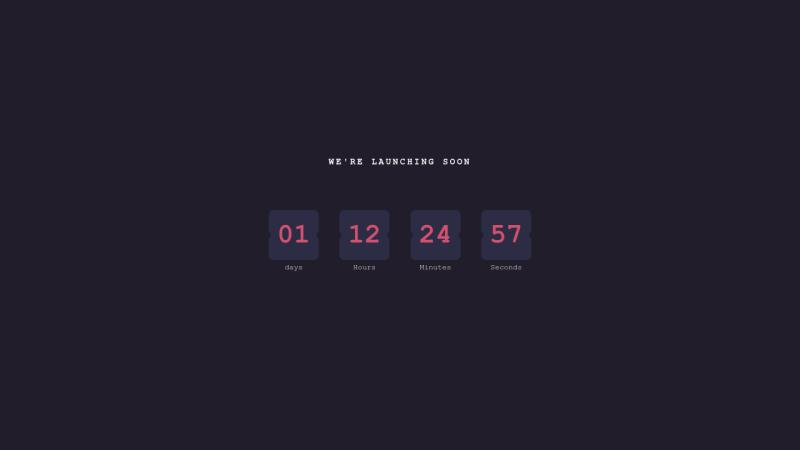

# Sobre

Mais um desafio realizado para o site Frontend Mentor

Nesse projeto desenvolvi um countdown no qual o próprio usuário pode controlar o tempo e a velocidade desejados através das seguintes linhas de comando no arquivo JS:

- let dias = 1; (escolhe os dias)
- let horas = 12; (escolhe a hora)
- let minutos = 24; (escolhe os minutos)
- let segundos = 59; (escolhe os segundos)
- let speed = 1000; // 1000 representa 1 segundo - velocidade padrão (escolhe a velocidade do countdown)

## Linguagens

- HTML
- CSS
- JavaScript

## Preview

Codepen: https://codepen.io/fabioguedesj/pen/NWvvZqm

    

